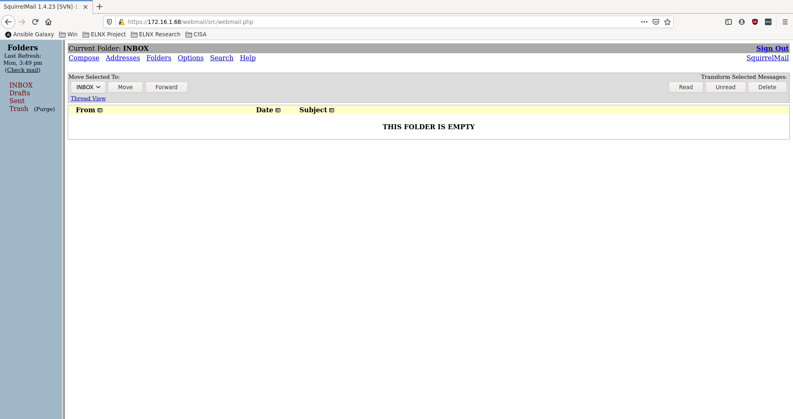
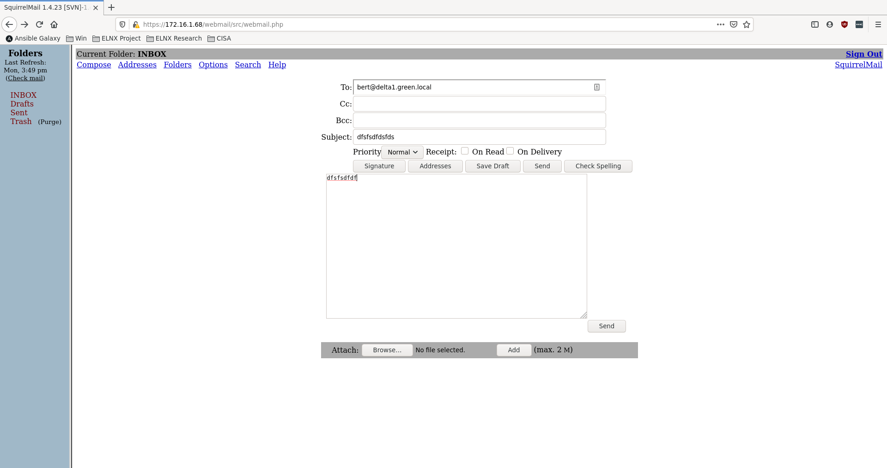
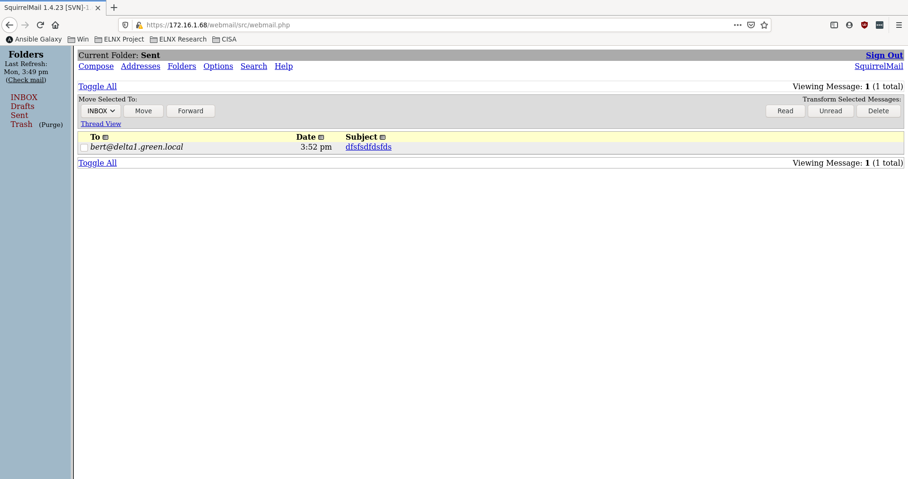
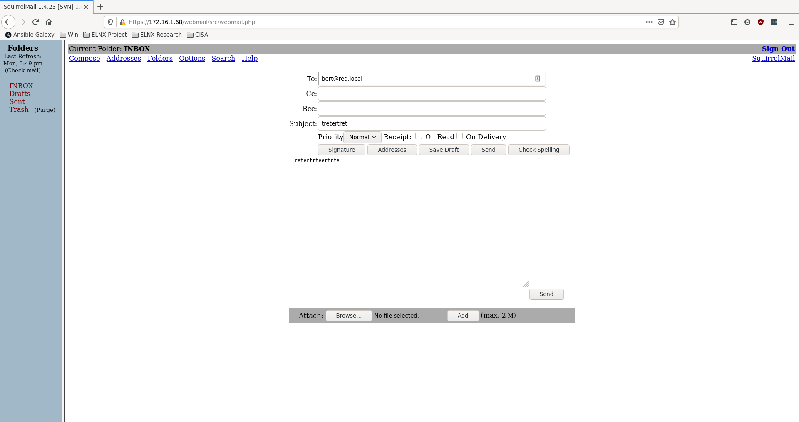
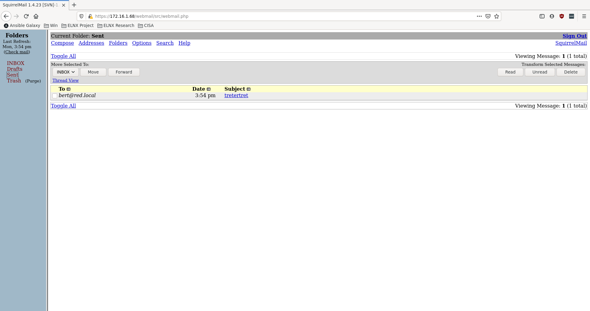

# Testplan Delta1 2019 12 16

## Requirements
- Correct IP-adres
- Correcte default gateway
- Correcte firewall instellingen
- Users kunnen mail naar elkaar verzenden BINNEN het eigen domein
- Users kunnen mail van elkaar ontvangen BINNEN het eigen domein
- Users kunnen mail naar elkaar verzenden BUITEN het eigen domein
- Users kunnen mail van elkaar ontvangen BUITEN het eigen domein
- Users kunnen inloggen in het webportaal
- Users kunnen hun mailbox bekijken in een webbrowser

## Stappenplan

1. Run script `/vagrant/scripts/delta1.sh`

2. Run BATS-test

- Correct ip-adres
- Correcte default gateway
- Correcte firewall instellingen

Run volgende commando's in terminal op de host

```
$ bats /vagrant/test/delta1/delta1.bats
```

Resultaat:

```
 ✓ Correct IP address
 ✓ Correct nameserver 1
 ✓ Correct nameserver 2
 ✓ Firewall is running
 ✓ Service 'https' allowed through firewall
 ✓ Service 'imaps' allowed through firewall
 ✓ Service 'smtps' allowed through firewall
 ✓ Service 'smtp-submission' allowed through firewall
 ✓ Service 'ldap' allowed through firewall

9 tests, 0 failures
```

3. Inloggen webportaal en mailbox bekijken in webbrowser

Open browser op url http://172.16.1.68/webmail

Log in met gegevens:

```
Name: milan
Password: milan
```

Klik op "INBOX" in de linkerkolom

Resultaat:



4. Mail verzenden BINNEN domein

Klik op "Compose" bovenaan de webpagina en voer volgende gegevens in

```
To: bert@delta1.green.local
Subject: anytesttexthere
```

en in het tekstveld:

```
Testtext in textarea from johndoe@green.local
```

Klik op "Send"



Klik op "Sent" in de linkerkolom. Hier zou de mail moeten terechtkomen.

Resultaat:



5. Mail verzenden BUITEN domein

Klik op "Compose" bovenaan de webpagina en voer volgende gegevens in

```
To: bert@red.local
Subject: anytesttexthere
```

en in het tekstveld:

```
Testtext in textarea from johndoe@green.local
```

Klik op "Send"



Klik op "Sent" in de linkerkolom. Hier zou de mail moeten terechtkomen.

Resultaat:




6. Mail ontvangen BINNEN domein

Klik op "Sign Out" rechts bovenaan de webpagina. Log weer in met volgende gegevens:

```
Name: bert
Password: bert
```

Hier zou de mail van "milan@green.local" moeten terechtkomen.

Resultaat:


7. Mail ontvangen BUITEN domein

Deze test kan pas uitgevoerd worden in samenwerking met Windows-kant van het project.

Resultaat:

```
%TODO
```